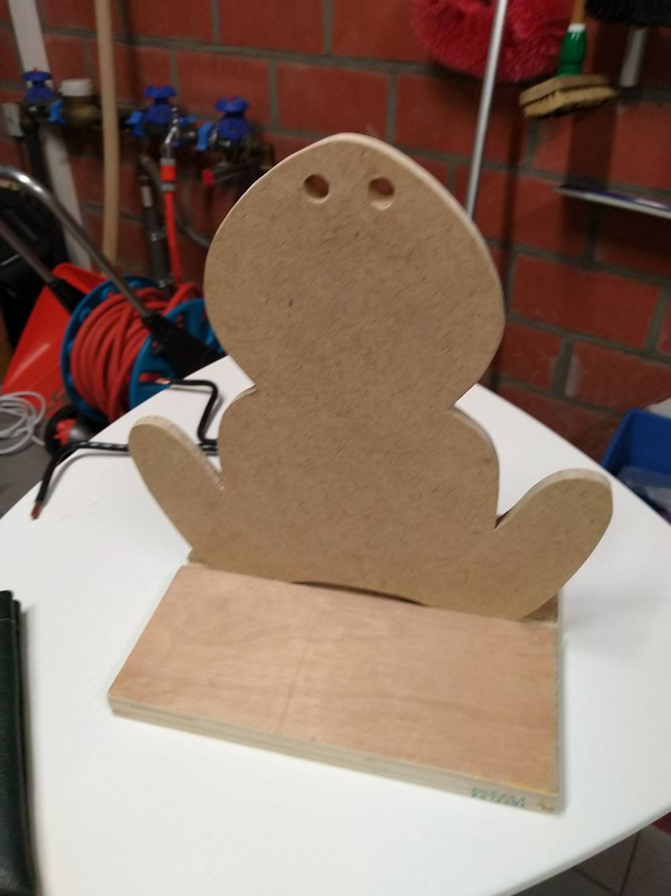
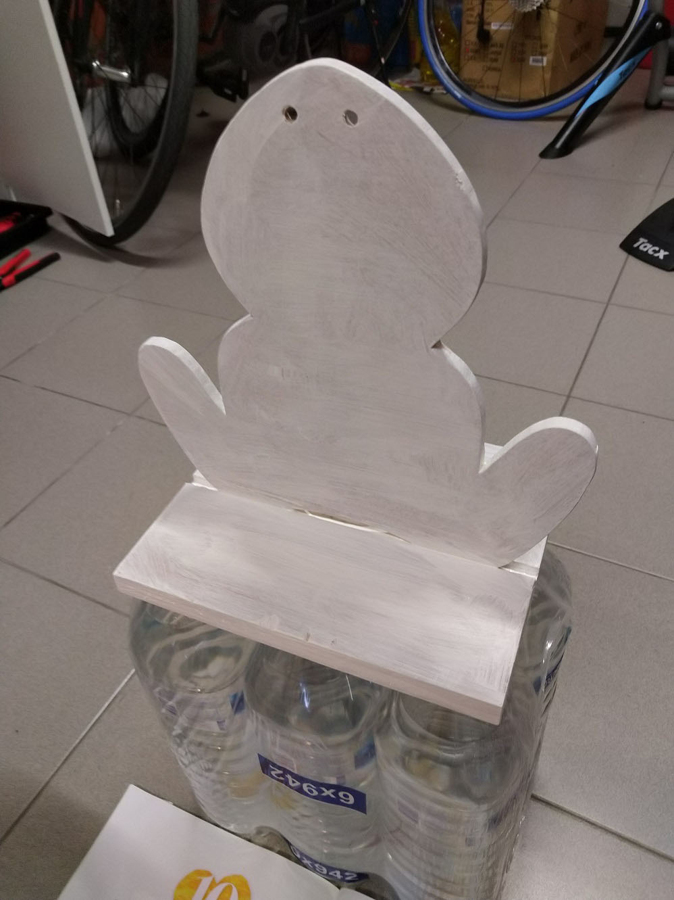
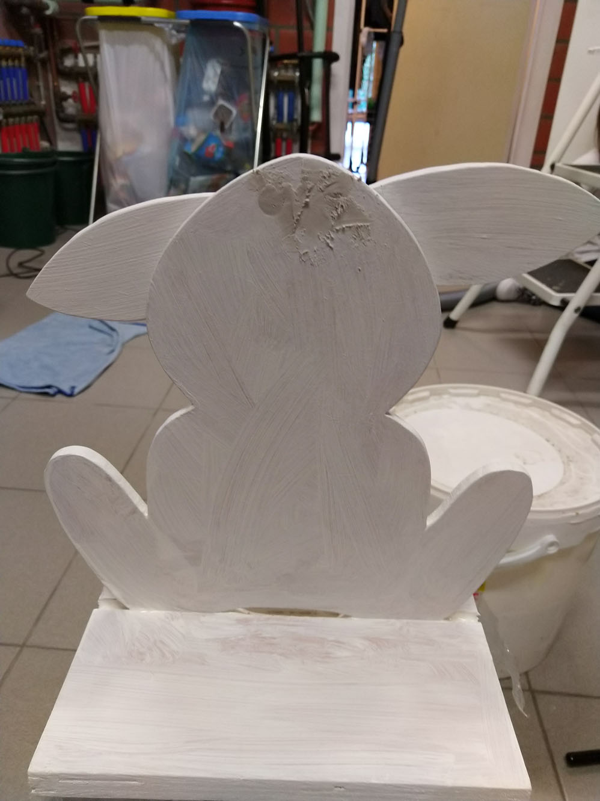
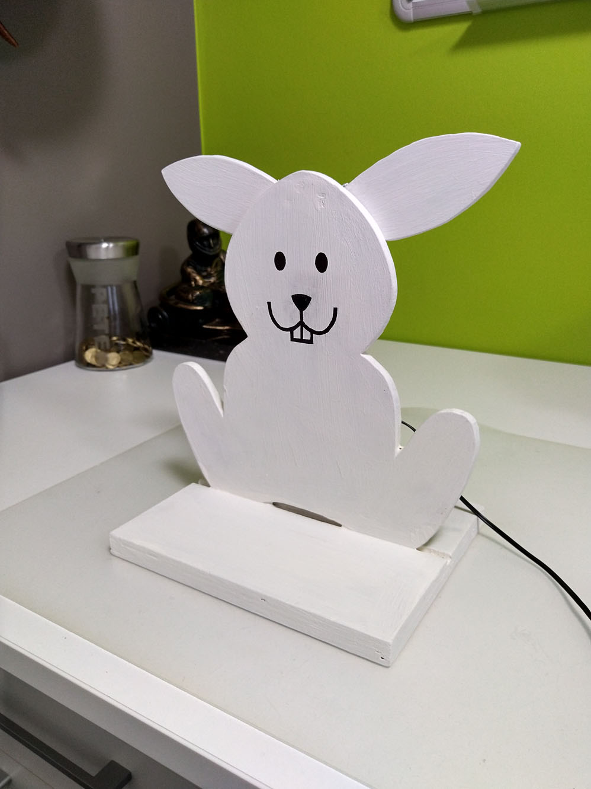

# Easter bunny

Funny easter bunny with servo controlled ears. Because we can.

## Components

* Arduino UNO
* Servo MG996R
* Parallax LaserPING Rangefinder (#28041)
* Nylon fishing wire
* 7.5V DC Power supply
* MDF, Plywood, Wires, Glue, Tape, etc

## Images

